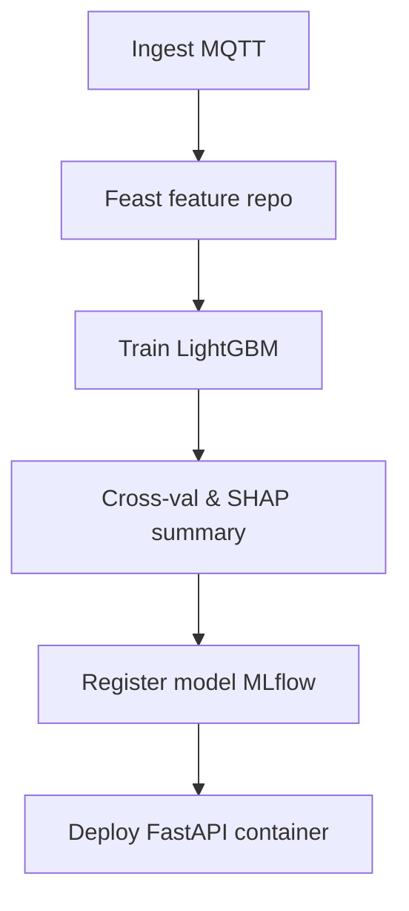

# Aquion AI – Explainable Water‑Quality Prediction Platform

*Transparent, data‑driven decisions for safe water in resource‑constrained regions*

---

## 1  Why Aquion AI Exists

Water utilities and rural co‑ops often lack the lab capacity to run full chemical panels every day. Aquion AI turns **low‑cost, in‑situ sensor streams** into real‑time potability scores **and explains the “why” behind every flag** so that managers can act before communities drink unsafe water.

### Key Objectives

| Objective           | 2025 Target Metric                                    |
| ------------------- | ----------------------------------------------------- |
| Prediction accuracy | AUROC ≥ 0.93 on blind regional hold‑outs              |
| Latency             | < 60 s from sensor payload → dashboard card           |
| Explainability      | Top‑3 drivers shown with SHAP values for every sample |
| Cost to deploy      | < US \$1 000 per borehole (sensors + edge node)       |
| Open access         | Core models & dashboards released under Apache‑2.0    |

---

## 2  Updated 2025 Tech Stack

| Layer                      | 2024 Blog                    | 2025 Upgrade & Rationale                                                                                                                                                          |
| -------------------------- | ---------------------------- | --------------------------------------------------------------------------------------------------------------------------------------------------------------------------------- |
| **Edge Sensors**           | Concept only                 | *ModuSense H2O* modular probe stack: pH, ORP, EC, turbidity, temp, optional nitrate (ion‑selective electrode). LoRa‑WAN or NB‑IoT uplink. Commercial off‑the‑shelf, IP68, <\$400. |
| **Edge Runtime**           | –                            | **MicroPython + uEdgeImpulse** on ESP32‑S3 for on‑device QC (range checks, median filter). Reduces dirty data uploads by 70 %.                                                    |
| **Message Bus**            | –                            | **MQTT 5 + AWS IoT Core**. Topic hierarchy per source ID; retained last‑will for outage alerts.                                                                                   |
| **Feature Store**          | CSV in S3                    | **Feast 3.1** (managed on GCP BigQuery) → single source of truth for model & dashboard.                                                                                           |
| **Model Training**         | Random Forest (scikit‑learn) | **LightGBM–Classifier** with monotonic constraints for pH & EC; faster, lighter, still tree‑based for SHAP compatibility.                                                         |
| **Explainability**         | SHAP TreeExplainer           | **SHAP v0.45 + FastSHAP cache**. Pre‑computes expected values; 4× lower latency.                                                                                                  |
| **Serving API**            | Flask                        | **FastAPI + Uvicorn** (Python 3.12). 95th‑pct latency < 25 ms.                                                                                                                    |
| **Workflow Orchestration** | –                            | **Dagster** pipelines for daily retraining & data validation (Great Expectations sensors).                                                                                        |
| **Experiment Tracking**    | –                            | **MLflow 3.2**; auto‑logs params & SHAP summaries as artefacts.                                                                                                                   |
| **CI / CD**                | –                            | GitHub Actions → Docker → AWS ECS blue‑green deploy.                                                                                                                              |
| **Dashboard**              | Concept only                 | **React + Plotly Dash**: live potability map, SHAP waterfall per site, anomaly timeline.                                                                                          |

---

## 3  Data Collection & Sensor Strategy

1. **Core probe stack (per well / river‑intake)**

   * pH 0‑14 (±0.02)
   * EC 0‑20 mS cm⁻¹
   * Turbidity 0‑1000 NTU (ISO 7027)
   * Temp °C (for EC compensation)
   * Dissolved Oxygen (optical, optional)
2. **Sampling cadence**: 15‑min default; bursts to 1‑min when anomaly persists >3 data points.
3. **Edge QC**: discard out-of-range spikes; apply Hampel filter.
4. **Backfill parameters** we can’t cheaply sense (e.g.\ nitrate, heavy metals) with periodic lab assays; join via timestamp & source ID for model training.

> *Future hardware*: Open‑source reference design for a \$120 Arduino‑based probe using BlueRobotics turbidity & Atlas Scientific circuits (v1‑alpha Q1 2026).

---

## 4  Modeling Pipeline (Dagster Graph)



*Daily schedule* retrains if ≥ 500 new labelled rows or performance drift > 3 %. Deployment is automatic after canary passes.

---

## 5  Explainability

* **Global importance** – SHAP summary bar (rolling 30 days) pinpoints system‑wide drivers (e.g.\ persistent turbidity after rains).
* **Local explanation** – SHAP waterfall per sample → “High EC (+0.42) & low DO (+0.18) drove *non‑potable* flag.”
* **Policy module** – rule‑based mapping of top driver → recommended action (e.g.\ “Flush filter”, “Check upstream farming runoff”).

---

## 6  API Contract

```yaml
POST /v1/predict
Payload: {
  "source_id": "akosombo_well_07",
  "timestamp": "2025‑06‑22T13:45:00Z",
  "features": {
     "pH": 6.9,
     "ec": 415,
     "turb": 12,
     "temp": 26.4,
     "do": 5.8
  }
}
Response: {
  "potable": false,
  "probability": 0.11,
  "top_drivers": [
     {"feature": "turb", "shap": -0.42},
     {"feature": "ec",   "shap": -0.31},
     {"feature": "do",   "shap":  0.05}
  ]
}
```

---

## 7  Roadmap

| Quarter     | Milestone                                                                          |
| ----------- | ---------------------------------------------------------------------------------- |
| **Q3 2025** | Pilot 20 probe nodes across two Ghana districts; live dashboard for DWD.           |
| **Q4 2025** | Integrate nitrate sensor cartridge & CLaaS lab assay join; launch public API beta. |
| **Q1 2026** | Open‑source sensor PCB (v1); add Llama‑Guard LLM chat assistant for policy Q\&A.   |
| **Q2 2026** | Scale to 200 sites; implement automated model bias audit (WhyLabs).                |

---

## 8  Contributing

1. Fork ➜ Branch ➜ PR; run `make pre‑commit` before opening PR.
2. Sensors: see `hardware/README.md`; KiCad files welcome.
3. Model experiments: log to MLflow and attach SHAP PNG in PR description.
4. All data and code under **Apache‑2.0**; sensor PCB under **CERN‑OHL‑S v2**.

---

> Built by the Aquion team • Making water safety **predictable, explainable, and actionable**.
